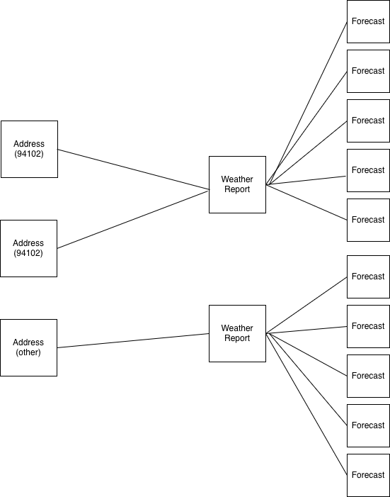

# ForecastWeather ⛈

_A little weather app showing the next 5 days forecast, using the [Google Geocoding](https://developers.google.com/maps/documentation/geocoding/overview) and [Google Weather](https://developers.google.com/maps/documentation/weather/daily-forecast) APIs_

### Quick Details

- Font is [Cherry Bomb One](https://fonts.google.com/specimen/Cherry+Bomb+One)
- International addresses are not fully supported ‼️ Refer to comment in:
  `app/jobs/fetch_forecasts_job.rb` (example input: "Manila, PH" will return no postal code)
- There are really only 2 routes (`addresses#index`, `addresses#create`). I was planning to extend
  this but ran out of time. I would like to bring back the full JSON responses on an `addresses#show`
  page or allow users to delete past requests, and thereby the cache, with a `addresses#destroy`

### Usage (local)

To get a local environment up and running...

Create a `.env` file and put the following into it:

```
GOOGLE_API_KEY='<YOUR_GOOGLE_API_KEY>'
GOOGLE_GEOCODE_URL='https://maps.googleapis.com/maps/api/geocode/json'
GOOGLE_FORECAST_WEATHER_URL='https://weather.googleapis.com/v1/forecast/days:lookup'
FORECAST_CACHE_MINUTES='30' # optional. you can also change this value to your choosing
```

Then in your favorite terminal:

```sh
$ bundle                     # bundle dependencies
$ rails db:create db:migrate # create database and migrate
$ rails s                    # start server
```

This was written in Ruby 3.4.1 but any Ruby 3.x _should_ work. After your server is running visit:

[localhost:3000](http://localhost:3000/) and type any address into the form, and you should see
results. Results by default are cached for 30 minutes by postal code.

Example:

search: _"City Hall, San Francisco"_ (postal code 94102) and you'll see some results with a timestamp
of when the forecast was retrieved.

then search: _"586 Hayes St, San Francisco, CA 94102"_ ([this Salt & Straw location](https://www.google.com/maps?s=web&sca_esv=c3663fb3fa70fe34&lqi=ChNzYWx0IGFuZCBzdHJhdyBuZWFyIgOIAQFI8aLmzKaugIAIWisQABABEAIQAxgAGAIiE3NhbHQgYW5kIHN0cmF3IG5lYXIqCAgCEAAQARACkgEOaWNlX2NyZWFtX3Nob3CaASRDaGREU1VoTk1HOW5TMFZKUTBGblNVTm1ka3BUUnpsM1JSQULgAQD6AQUIkwEQPQ&vet=12ahUKEwjIoNKd6caQAxVPMUQIHdkTMKgQ1YkKegQIJRAB..i&cs=1&um=1&ie=UTF-8&fb=1&gl=us&sa=X&geocode=KY9xCVuigIWAMQfg5ffwK81T&daddr=586+Hayes+St,+San+Francisco,+CA+94102)
in the same postal code) and you'll have the same timestamp for the forecast.

Tests can be run via:

```sh
$ rspec
```

### Results

You'll notice in `app/lib/google/weather.rb` that we fetch only `daytimeForecast`. There is a
`nighttimeForecast` that is brought back the response as well but for now I used only daytime for
simplicity's and time's sake.

### Icons

Ideally we'd like to cache and leverage a CDN for icons, but for the purposes of this little app,
this is fine... for now.

### Cache

Right now, we are leveraging solely Postgres. The desired output is to have results cached for 30
minutes by postal/zip code. You can set this environment variable to anything you'd like, as shown
above.

Ideally, I'd prefer to use [Redis](https://redis.io/) but wanted to keep setup as simple as possible,
for now.

### Tables and Models and solution discussion

```rb
Address         # requested address by the User
Forecast        # a forecast for a given day
WeatherReport   # a collection of Forecasts, join
```

I didn't come up with my ideal solution as I wasn't sure how far to go in any direction, as things
were left open ended. Right now, each Address has: 5 Forecasts and 5 WeatherReports. This is not ideal
in my opinion, but does work.

A more ideal way would be...

For each Address:
Create a WeatherReport with a postal_code, and a forecasted_at time
A forecast would be a big piece of JSON (the response we get, stored as jsonb)

When a reequest is made:
Akin to my query now, look for a WeatherReport with a postal_code of less than 30 minutes in the
forecasted_at column, and make a many-to-many relation. This removes the forecast object, but a
join table would be needed. Something like AddressWeatherReports.



The solution I do have now does show off more Rails and ActiveRecord integration in my opinion, which
is why I stuck with it, but wanted to call out that if we were to scale this for a higher number of
users (and I wasn't limited on time), I would alter my current solution.
